# GreedyTile

[](https://crates.io/crates/greedytile)
[](https://github.com/GeEom/greedytile/actions/workflows/ci.yml)
[](https://github.com/GeEom/greedytile/actions/workflows/rust.yml)
[](https://github.com/rust-secure-code/safety-dance/)
[](./LICENSE.txt)
[](https://codecov.io/gh/GeEom/greedytile)

Fast pattern synthesis preserving local tile constraints. Safe Rust implementation with CLI and library interfaces.

## Examples

| Source | Generated |
|--------|-----------|
|  | 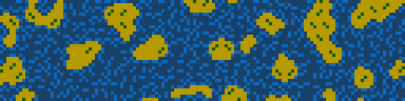 |
| 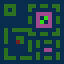 | 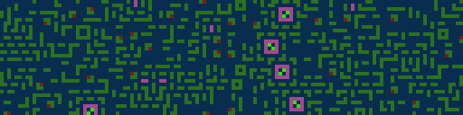 |
| 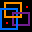 | 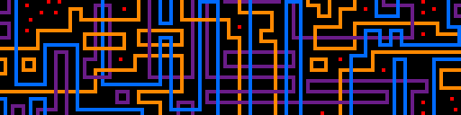 |
| 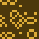 | 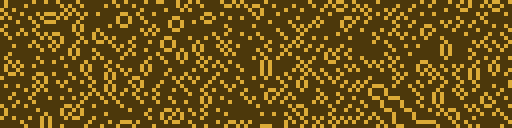 |
|  | 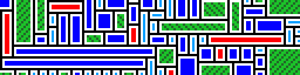 |
| 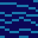 | 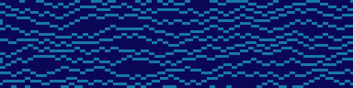 |
| 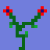 | 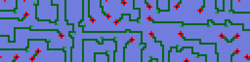 |

## Installation and usage

```bash
# Install with Rust 1.88.0 or later
cargo install greedytile

# Generate pattern from source image
greedytile input.png

# Process directory of images
greedytile ./patterns/
```
## Options


| Option | Description | Default | Without Option | With Option |
|----------|-------------|---------|----------------|-------------|
| `--seed` | Seed reproducible generation | 42 |  | 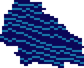 |
| `--iterations` | Maximum iterations| 1000 | 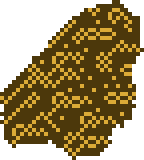 |  |
| `--prefill` | Use content of `<input>_pre.png` | disabled | 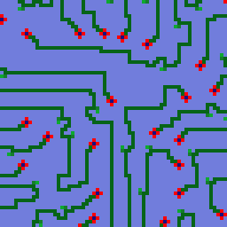 | 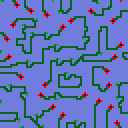 |
| `--visualize`  | Generate placement animation | disabled | | 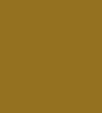 |
| `--width` | Maximum pixel width | unbounded |  | 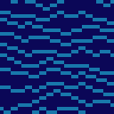 |
| `--height` | Maximum pixel height | unbounded | | |
| `--rotate` | Enable 90°/180°/270° tile rotations | disabled | 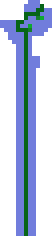 | 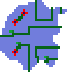 |
| `--mirror`| Enable tile reflection | disabled |  | 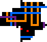 |
| `--quiet` | Suppress progress output | verbose |
| `--no-skip` | Process overwriting existing output | skip existing |

## Details

GreedyTile generates patterns by placing 3×3 tiles extracted from a source image. Weights for randomly selecting placement are influenced by several factors:

1. **Entropy weighting**: Prioritizes positions where fewer tile options are valid (similar to [WFC](https://github.com/mxgmn/WaveFunctionCollapse/))
2. **Global balance correction**: If pixels are under-represented then selection is biased towards the source balance
3. **Distance-based probabilities**: Pixel distance patterns in the source are replicated in the output
4. **Deadlock recovery**: If no choices exist which respect tiles, pixels in a local area are removed before continuing

## Commentary

For efficiency, the global balance correction uses a normal distribution to approximate what should technically be a binomial distribution. The approximation becomes accurate at large counts where it matters most.

The distance probability weighting has more impact on easily tiled patterns than complex ones. Restrictive patterns often have less valid tile choices, making the probabilistic selection less relevant.

## Limitations

- **Fixed tile size**: Currently hardcoded to sample 3×3 pixel tiles from the source
- **Extensibility**: Would be improved by a plugin interface for adding new probability rules
